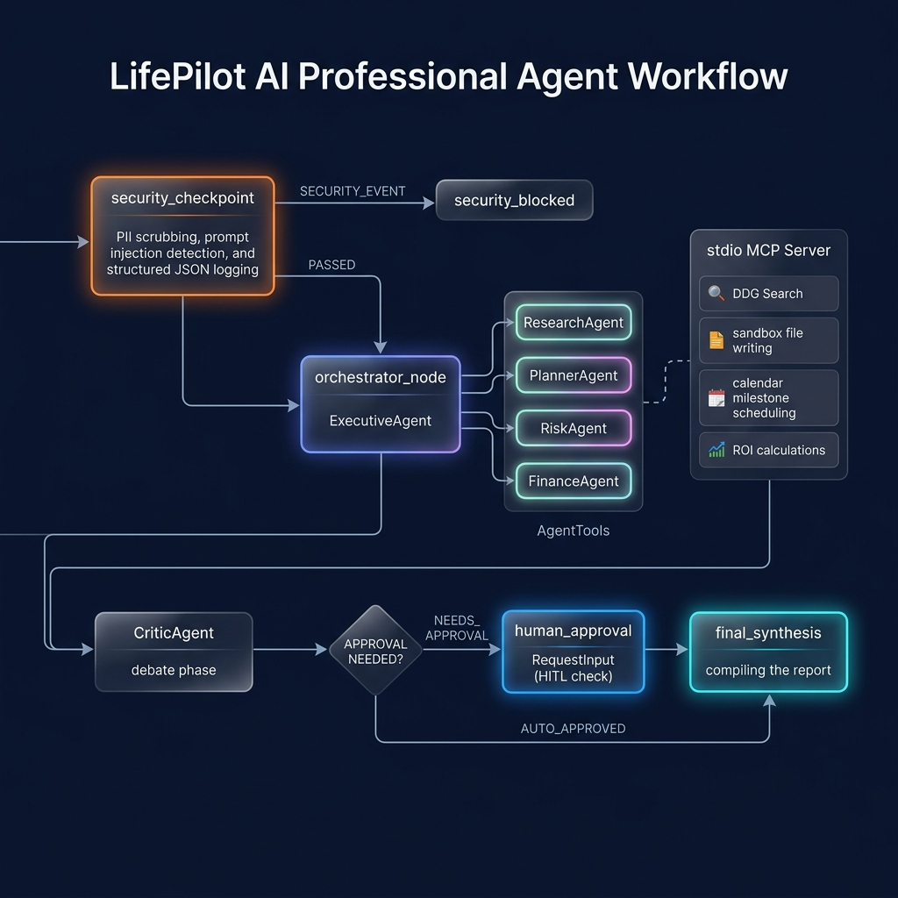

# LifePilot AI: Decision-Making Agent Operating System

LifePilot AI is an AI-powered operating system built with the **Google Agent Development Kit (ADK)** and Gemini. It orchestrates specialized agents to help users make career, education, and financial decisions through parallel reasoning, debate, and consensus.



---

## What this repository contains

- A Python backend service under `backend/`
- A simple SPA frontend at `frontend/index.html`
- A lightweight UI for submitting queries and streaming agent reasoning
- A sandbox file explorer for Planner output
- Docker Compose support via `docker-compose.yml`

---

## System Flow Diagram

```text
              [ USER QUERY ]
                    │
                    ▼
          ┌───────────────────────┐
          │  security_checkpoint  │
          └───────────────────────┘
                    │
         ┌──────────┴──────────┐
         │                     │
    (SECURITY_EVENT)      (PASSED)
         ▼                     ▼
  ┌──────────────┐       ┌──────────────┐
  │ security     │       │ orchestrator │
  │ blocked      │       │  (Executive  │
  └──────────────┘       │    Agent)    │
                          └──────────────┘
                                  │
                   ┌──────────────┬──────────────┐
                   ▼              ▼              ▼
             ┌──────────┐   ┌────────────┐   ┌──────────┐
             │Research  │   │ Planner    │   │ Critic   │
             │ Agent    │   │ Agent      │   │ Agent    │
             └──────────┘   └────────────┘   └──────────┘
                   │              │              │
                   ├──────────────┴──────────────┤
                           ▼
                     ┌──────────┐
                     │ Executive│
                     │ synthesis│
                     └──────────┘

---

## Key Features

1. **Google ADK multi-agent orchestration**: Runs Executive, Research, Planner, and Critic agents in a simplified workflow.
2. **Parallel specialist reasoning**: Research and Planner agents execute together to collect insights and generate a roadmap.
3. **Critic review phase**: The Critic Agent validates the output before final synthesis.
4. **Live terminal streaming**: Frontend streams agent reasoning traces from the backend in real time.
5. **Sandbox file explorer**: Planner output files such as `roadmap.md` are saved and viewable.
6. **Prompt injection protection**: User inputs are checked before workflow execution.

---

## Setup & Local Installation

### Prerequisites
* Python 3.10 or higher
* Google Gemini API Key

### Step 1: Clone and Initialize Virtual Environment
Open PowerShell (or your terminal) and run:
```powershell
# Create a virtual environment
python -m venv .venv

# Activate the virtual environment
# On Windows (PowerShell):
.venv\Scripts\Activate.ps1
# On macOS/Linux:
source .venv/bin/activate
```

### Step 2: Install Dependencies
```powershell
pip install -r backend/requirements.txt
```

### Step 3: Configure environment variables (Add API Key)
Copy the environment variables template and add your Gemini API Key:
```powershell
cp backend/.env.example backend/.env
```
Open `backend/.env` and replace `your_gemini_api_key_here` with your active key:
```env
GEMINI_API_KEY=AIzaSyD...
GEMINI_MODEL=gemini-2.5-flash
```

### Step 4: Run the Application
Start the FastAPI server:
```powershell
python -m uvicorn app.main:app --reload --host 127.0.0.1 --port 8000
```
Open your browser and navigate to:
👉 **[http://127.0.0.1:8000/](http://127.0.0.1:8000/)**

---

## Docker Deployment

You can deploy the entire stack instantly using Docker Compose:
1. Ensure your `.env` contains your `GEMINI_API_KEY`.
2. Run:
   ```bash
   docker-compose up --build
   ```
3. Open `http://localhost:8000/` in your browser.

---
